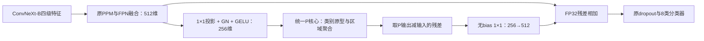

# UP：ConvNeXt-B + UPerHead + 多原型区域语义 P

日期：2026-10-01。状态：**代码已实现；24项核心/头检查通过；本地完整模型 AMP 开发 smoke、官方数据 Runner 短程链路及1024滑窗通过；未做服务器 smoke、正式训练、完整验证或平台提交。**

## 1. 来源、假设与改动范围

控制来源是 `code/v1` 的 v04 等价配置。对应历史解析配置 SHA256：`09646cce458c49c1d72c434b6c0cb44e116da3ab343a05198cf6ebf7ab051e5f`。历史 v04 mIoU76.32、荒地IoU51.53，不能写成UP成绩。精确逐像素定位来自根诊断报告中的v03，不能替代v04真实混淆。

假设：类别绑定的多个外观原型能为当前图像提供更稳定的区域上下文，减少荒地与背景/农田的双向内部混淆。多原型表征和区域聚合是同一个P模块的环节；当前没有精度收益证据。

| 文件 | 职责 |
|---|---|
| `configs/control_convnextb_rmi_768.py` | 本版本内保存的控制快照，不跨版本继承 |
| `configs/convnextb_uper_proto_768.py` | 唯一UP主配置，从同目录控制快照继承 |
| `aicseg/prototype_core.py` | 可供MP原样复制的纯PyTorch核心 |
| `aicseg/prototype_uper_head.py` | UPer的512↔256适配及loss后统计更新 |
| `aicseg/prototype_hooks.py` | 周期性原型日志，支持配置核心路径 |
| `prototype_contract.json` | 冻结接口、超参数及核心/Hook哈希 |
| `tests/test_prototype.py`、`tests/test_uper_integration.py` | 原型约束、旁路等价、AMP与梯度验证 |
| `tools/verify_up.py` | 有限开发核验入口，不计算验证成绩 |

复制控制版本必要的aicseg与版本工具，更新train、monitor、predict的默认配置。没有修改根文档、共享框架、根工具、官方图片、历史版本或其他候选。没有新增第三方依赖；P使用现有PyTorch。源码分支为`codex/v1-up-uper-proto`；通过独立Git索引构造本版本提交，保持当前共享checkout，避免切换影响并行聊天。未推送或合并。

解析后相对控制配置的差异只有experiment_name、work_dir、主头类型/P参数以及诊断Hook。ConvNeXt-B、分类预训练、PPM/FPN、主CE1.0+RMI0.5、辅助FCN CE0.4、GN、增强、划分、优化器、调度及评测保持原设置。没有新增监督损失。

## 2. 冻结的P机制

P是本项目定制的统计多原型上下文模块，借鉴[多原型表示思路](https://arxiv.org/abs/2203.15102)，不是ProtoSeg原方法的完整复现，不替换原分类器。

固定8类，每类K=4，内部D=256，温度τ=0.1，EMA动量m=0.99，逐通道残差gate初值0.001，每类每次最多2048个更新点。原型是buffer，不是额外可学习类别query；可学习投影通过既有分割损失得到梯度。

设P输入为z，查询q_i=normalize(W_q z_i)，类别原型M_(c,k)归一化。对所有已初始化槽统一计算：

```text
a_ij = softmax_j(q_i · M_j / τ)              # 每个像素在有效槽之间选择
r_j  = Σ_i v_i a_ij W_v z_i / max(Σ_i v_i a_ij, ε)
t_i  = Σ_j a_ij r_j
P(z)_i = z_i + γ ⊙ W_o t_i
```

v来自图像/padding几何，不来自GT。区域值r_j来自当前图像，类别原型决定其聚合权重。不会对每个类别强制分配一块区域；没有支撑的槽零贡献。仅生成像素×32槽矩阵，不生成像素两两注意力。

训练统计流程：

1. bank从全零/无效槽开始；没有有效槽时原对象旁路，不使用随机伪类别原型。
2. 本批先使用旧bank完成预测和CE/RMI计算。
3. 在`loss()`末尾、backward之前调用一次`update_from_labels()`。只使用本批官方训练GT；forward/predict不接受GT。
4. GT最近邻映射到特征网格；任何GT Ignore覆盖的聚合cell不更新bank，几何padding也排除。混合类别cell仍以代表点类别编号分配，这是首版统计近似，不声称所有点都是纯区域内部。
5. 对类别c内的有效归一化查询做确定性最远点初始化。数据不足/无差异时保留冷槽，不复制同一向量假装4个模式。
6. 更新点只分配给GT类别c中的最近原型。非空组均值μ归一化后，`M←normalize(mM+(1-m)μ)`；不存在的类别和空组保持原值。

EMA每个训练micro iteration更新，而非每个优化器更新；无有效点时不更新。`prototype_bank`、`prototype_valid`、`assignment_counts`、`class_seen_pixels`、`update_steps`均在state_dict中。前向使用`detach().clone()`快照，loss后原地更新不会破坏backward。

统计更新在关闭autocast的float32中执行。AMP下active核心输出及残差加法保留float32，避免微小残差相加后再相减被FP16吞掉；冷启动和禁用分支返回原对象/原dtype。沿用AmpOptimWrapper的动态loss scaling。首版只支持单GPU训练，多rank统计更新显式报错，避免不同rank产生不同bank。

GT Ignore不用于前向区域mask，以保持训练/推理一致；它从原损失和训练统计更新排除。验证/测试只读取训练所得bank，不更新统计。

## 3. UPer适配与MP接入



P关闭时在通道投影前直接旁路，不留下额外变换；原PPM/FPN/classifier参数名保持不变。新增参数初始化使用CPU RNG隔离，不改变之后原模块的随机初始化。总参数122,453,136，新增459,520（核心196,864；UPer适配262,656）。

MP复制`prototype_core.py`、必要的`prototype_hooks.py`、核心测试与`prototype_contract.json`，不要复制UP专用适配器或跨版本import。只复制源码，不复制UP训练bank或分割权重；MP从相同分类预训练独立初始化，bank由自己的训练特征建立。核心文件必须与冻结哈希一致；MP可做自身通道/尺度适配，但不得暗中改P机制/超参数。

```python
enhanced = core(mask_features, geometric_valid_mask)  # 一次前向，无GT
delta = enhanced - mask_features.float()
# 将delta适配到mask_features和query memories，残差相加保持float32。
# 当前查询预测与loss计算后，仅更新一次：
core.update_from_labels(mask_features.detach(), training_labels, geometric_valid_mask)
```

核心接口只依赖PyTorch，Hook通过`core_path`找到核心。MP选择实际路径；默认UP路径是`decode_head.prototype_adapter.core`。P各层状态必须随MP checkpoint保存，不可在val/test按预测更新。

冻结SHA256：

- `prototype_core.py`：`9a34dcc0d0816990a6852965032c8ecaa427b4f00b66a90009262bd373e714bb`。
- `prototype_hooks.py`：`a61e295d60002e9a72153ce344f47c7b0b2163f03115b76cae9577a408c7e4a5`。

## 4. 已执行验证与证据

本地环境：Windows、RTX4060 Laptop 8GB、Python3.10.20、torch2.0.1/CUDA11.8、MMCV2.0.0、MMEngine0.10.7、共享MMSeg1.2.2。与服务器标准torch2.1/CUDA12.1/MMCV2.1不同，没有把本地检查写成服务器通过。

### 4.1 不变量与集成

17项核心检查+7项头集成检查全部通过，包括：

- 冷启动/关闭P真正旁路；eval logits及预测与U0逐值一致；匹配dropout随机状态后的训练损失逐值一致。
- 当前预测不见当前标签更新；原型的类别绑定、类缺席、全Ignore、padding、冷槽和EMA公式。
- loss后更新再backward；所有新增可学习参数均有有限、非零梯度。
- CUDA AMP+GradScaler、FP32统计、小残差保真、checkpoint恢复和eval统计冻结。
- 配置比较确认只变更声明字段，无新loss。

本地开发证据现保存在AIC根的`runs/diagnostics/20261001_up_feasibility/`，不属于版本源码。旧目录从本版本`runs/`整体移到该诊断区的`original_version_runs/`；原配置、日志及其中的绝对路径未改写，位置映射见`relocation_manifest.json`。下列`original_version_runs/`路径均相对此诊断区。

日志：`original_version_runs/v1_up_convnextb_uper_proto_768/20261001_213126_verification/test_prototype.log`及`test_uper_integration.log`。

### 4.2 分类预训练与完整模型

两次独立开发核验目录：

- `original_version_runs/v1_up_convnextb_uper_proto_768/20261001_213126_verification/`：含完整测试、预训练及8步开发smoke。
- `original_version_runs/v1_up_convnextb_uper_proto_768/20261001_214057_verification/`：复核AMP实际优化器步数；复用同一分类权重，未重复测试。

各目录保留`verification_summary.json`、解析核验配置、模型状态权重及必要日志；第二次含`console.log`。本地实际命令：

```text
<existing-python> -B tools/verify_up.py --download-pretrained --gpu-smoke
<existing-python> -B tools/verify_up.py --pretrained <first-run>/classification_pretrained.pth --gpu-smoke --skip-tests
```

公开分类权重SHA256：`262fd0376855955f20f6c036aa882f5cb22b88333b766b0fa20174339c11d70d`。实际加载340个主干张量、87,564,416个元素，逐值一致，源主干张量无遗漏。四级输出norm0..3的8个张量不在源checkpoint中，按原实现初始化；沿用v04加载方式，没有自行重映射或声称100%参数均来自预训练。没有加载分类head或外部分割权重。

每次仅8个128×128官方训练图裁剪、batch1/累积4。第二次从AdamW state计数确认2次真实更新，loss scale始终65536，未跳步；保存恢复预测逐值一致，eval不接收GT且bank状态不变。验证集未训练/评分，测试集未使用。人工裁剪只是开发输入，不冒充正式增强pipeline或同预算训练。

完整模型smoke峰值分配2323.52MiB。独立适配器B1×512×192×192的AMP前向+反向相对旁路增加244.29MiB；这是单次本地局部测量，不是整模型768/batch2显存或服务器耗时预测。

8步实际初始化24/32槽，水体和车辆未在这组裁剪中出现，保持冷槽。荒地4槽累计分配为45/1295/109/53，均被使用但明显不均衡；不足以证明训练后不会塌缩。正式训练需持续检查assignment_counts、attention_mass、winner_counts、类内最大cosine和残差幅度。Hook每50iter追加`prototype_diagnostics.jsonl`，不添加loss或自动重置原型。

累计完整模型开发smoke为16 micro iterations，4个名义优化器更新点；第二次2步已独立核实，第一次没有单独记录AdamW步数。未运行完整验证、正式训练、服务器训练链路或比赛提交。smoke权重只用于开发核验，没有保存完整优化器恢复状态，禁止作为正式训练的resume/init来源。

### 4.3 实际版本训练入口

补充执行本版本`tools/train.py --smoke --smoke-iters 4`，保留官方随机缩放、768裁剪、D4、PhotoMetricDistortion及CE/RMI。仅开发链路设置物理batch1、累积4、worker0、关闭cudnn benchmark、原型/训练日志间隔1；验证只取固定验证集第一张图，使用原slide768/stride512。关闭最佳模型选择，checkpoint不保存优化器和调度器状态。命令、实际配置、环境、日志、4条P诊断和`iter_4.pth`保存在诊断区`20261001_2307_runner_smoke_utf8/`。

实际4micro/4张训练样本曝光，数据加载、损失、Hook、checkpoint保存和单图验证均完成。该4步smoke的唯一累积更新点落在零学习率；不能据此宣称参数得到有效训练或1次成功学习更新。先前第4.2节中的真实AdamW更新核验仍独立保留。Logger记录的训练显存最大值4081MiB；Hook摘要的峰值会受Logger重置统计影响，不用它推算服务器物理batch2资源。

首次`20261001_2305_runner_smoke/`在任何训练迭代前因Windows环境信息的MSVC GBK解码失败；设置`PYTHONUTF8=1`后使用新目录重试通过。失败证据保留，不计入训练步数。不修改共享框架或环境。现有本地诊断环境`pip check`还报告OpenCV4.13与NumPy1.26.4的声明冲突；本次运行通过不代表依赖检查通过，接收者按`docs/setup.md`的OpenCV4.11/NumPy1.26.4及标准服务器环境复现。

另在新进程严格恢复`iter_4.pth`，对同张1024验证图只提供图像和几何元信息、不提供GT，输出8×1024×1024有限logits和0..7预测，P状态逐值不变；checkpoint含4次训练统计更新、28个有效槽。核验及权重哈希见该run的`checkpoint_slide_audit.json`，一次性复核脚本留在诊断区，不随版本交付。

累计本地训练smoke现为20micro，未超过300iter/2小时限制。单张验证仅核验链路，不是完整验证成绩，不用于方案选择。

## 5. 可摘取前提、预算和命令

只依赖标准AIC根的官方`data/`、根公共`tools/`、同级`code/mmsegmentation/`及`docs/setup.md`声明的环境。当前通过GitHub交付版本源码，不包含runs、权重、预测、赛事图片、缓存或MMSeg副本。一个进程只加载本版本aicseg。

已将源码ZIP解压到独立标准目录，提供同级共享MMSeg，在全新进程运行17项核心及7项头检查，全部通过；另确认aicseg实际导入解压副本，而非原UP目录。旧记录现位于诊断区`original_version_runs/v1_up_convnextb_uper_proto_768/20261001_215016_delivery/portable_core.log`和`portable_head.log`。此核验不等于服务器训练链路通过。

本次统一发布清理删除一次性的`tools/package_version.py`，不再额外生成源码ZIP；旧源码包及摘取检查证据仍保留在本地诊断区。GitHub版本保留`configs/`、`aicseg/`、`tools/`、`tests/`、依赖、契约和本说明，整个目录可放入标准服务器`code/`下。训练shell脚本使用LF；本版本`.gitattributes`固定文本LF，避免Windows Git checkout改变冻结核心的字节哈希。MP版本也应固定所复制文件的LF换行。模型、配置、P核心和Hook的冻结字节未改；可复用验证及赛事预测打包工具继续保留。

上传前UP目录只保留源码、必要本地控制配置、依赖、契约、版本说明与可复用检查工具；运行产物和缓存已移出。自动审批阻止了临时目录链接删除，实际未删除文件；旧ZIP、Git临时索引和解压副本连同证据移入诊断区，不上传。解压副本中的`mmsegmentation`是指向共享框架的junction，后续清理不得递归删除其目标。测试和`verify_up.py`用于复核P契约/旁路/AMP，不是运行依赖；保留以支持成员检查和MP复用。训练和推理不依赖本地诊断目录、开发权重或私有解释器路径。

正式待审批预算：seed2026，5596/1400固定划分，物理batch2/累积4，有效batch8，40000 micro iterations、10000优化器更新、80000样本曝光；warmup750，验证/保存间隔4000，slide768/stride512。长训练仍需用户明确授权，开发smoke不得自动续训。

所有GPU命令执行前核对GPU、tmux及目标run状态并排队。当前已执行20步；后续smoke须核验全版本累计300iter及2小时上限，不能单个run各跑300步。

```bash
export AIC_ROOT=/root/autodl-tmp/AIC
export MODEL_DIR="$AIC_ROOT/code/v1_up_uper_proto"
export CONFIG=configs/convnextb_uper_proto_768.py
export OMP_NUM_THREADS=1
cd "$MODEL_DIR"

# 开发检查，CUDA测试须已有GPU排队许可：
python -B tests/test_prototype.py
python -B tests/test_uper_integration.py

# 标准服务器链路smoke；本次未执行，先核验剩余预算：
bash tools/start_train.sh --config "$CONFIG" --smoke --smoke-iters 50

# 以下仅在取得正式长训练授权、且smoke通过后执行：
bash tools/start_train.sh --config "$CONFIG"
# 仅对应正式run中断时恢复，绝不恢复开发权重：
bash tools/start_train.sh --config "$CONFIG" --resume /absolute/path/to/formal_run
python tools/monitor_training.py --config "$CONFIG" --run /absolute/path/to/formal_run --once
```

正式若因显存改为batch1，应使用累积8、80000micro iterations、warmup1500、验证/保存间隔8000，保持曝光/更新预算，并记录完整解析配置；不得只改batch后照跑40000iter。24GB服务器GPU/耗时尚未实测，历史v04约4.89小时只能用于规划，UP不能据此声称同样耗时。

## 6. 后续验收与未证明事项

主指标是固定完整验证集mIoU；同时比较荒地IoU/Precision/Recall、荒地↔背景/农田混淆、无荒地GT图误报、困难外观召回及区域内部错误。需要补齐U0真实验证预测，不能拿v03混淆比例替代U0对照。

若只改善荒地却降低整体mIoU，不认定胜出；若原型长期空闲/趋同或残差接近零，应先报告机制未有效利用，不自动增加新loss、G或重置策略。正式同预算无提升或收敛证据不足均如实报告；不以训练loss/开发smoke判断成绩，不把单种子提升写成统计显著或平台提升。
